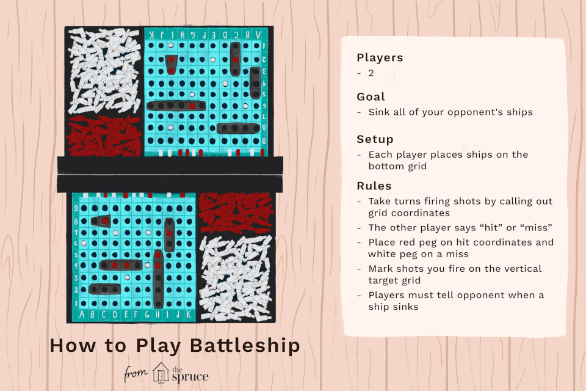

# Battleship

A weekend project with my buddy recreating the classic battleship board game.

## How to play battleship

[Rules to Battleship](https://www.thesprucecrafts.com/the-basic-rules-of-battleship-411069)
[Wikipedia entry for Battleship (game)](https://en.wikipedia.org/wiki/Battleship_%28game%29)

### Fleet

| No. | Class of ship | Size |
| --- | ------------- | ---- |
| 1   | Carrier       | 5    |
| 2   | Battleship    | 4    |
| 3   | Cruiser       | 3    |
| 4   | Submarine     | 3    |
| 5   | Destroyer     | 2    |

## Project Overview

- Establish 2 players, and connect the to the same game
- Each player has to setup their pieces
- Players take turns until one of the players has sunk all the ships of their opponent.

# key

0 Empty
5 Carrier (5)
4 Battleship (4)
3 Cruiser (3)
2 Submarine (3)
1 Destroyer (2)

0 blank
1 miss
2 hit

0 0 0 0 0 0 0 0 0 0
0 0 0 0 0 0 0 0 0 0
0 0 0 0 0 0 0 0 0 0
0 0 0 0 0 0 0 0 0 0
0 0 0 0 0 0 0 0 0 0
0 0 0 0 0 0 0 0 0 0
0 0 0 0 0 1 0 0 0 0
0 0 0 0 1 0 1 0 0 0
0 0 0 1 2 2 2 2 2 0
0 0 0 0 0 0 0 0 0 0
